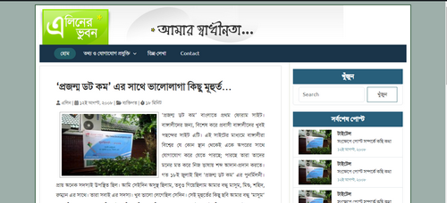

# Radixpointbd - Laravel 10 Project

(A Laravel project for client.) A company portfolio dynamic website for RadixPointBD (Interior, Exterior, Landscape and Construction solution).

Admin can manage the portfolio such as add new project, update and delete the project from dashboard. 

## Instruction:

<ul>
    <li>1. Creating a Database 'radixpointbd' in your database server</li>
    <li>2. composer install or, composer update</li>
    <li>3. 'npm install' and then 'npm run dev' ('npm run build' before production/host)</li>
    <li>4. copy the file .env.example and rename into .env, then give information of database, server and create app key by 'php artisan key:gen' the save the file</li>
    <li>5. php artisan migrate</li>
    <li>6. The 'created_at' and 'updated_at' fields must be timestamped. After migrating, go to the structure of each table from the database server and make changes from there. Then change role 0 into 1 from users table for the admin after registration for admin.</li>
    <li>7. php artisan serve</li> 
    <li>8. hit '/admin' route for dashboard and input company emmail address in settings from settings menu.</li> 
</ul>

## For Deployment (by FTP Deploy Action - Github Action)
1. At first run the project from local -  
php artisan serve or from local server.   
2. then run npm build command -  
npm run build  
3. now checkout 'production' branch - 
git checkout production  
4. and then 'merge' with 'main' branch - 
git merge main 
5. then push from production branch to production branch - 
git push -u origin production 
6. again checkout main branch after completed - 
git checkout main 
7. wait few seconds and go to cPanel of 'radixpointbd' and modify '.env' file such as - 
APP_URL=https://radixpointbd.com/  
ASSET_URL=https://radixpointbd.com/public    
(and also Mail config, Database config etc from '.env' file.)

### User Role:

<ul>
    <li>super admin (role 2) - can access everything. It will be created by developer.</li>
    <li>admin (role 1) - can access everything, excluding 'access superadmin user data'. this user can't create, update or delete any superadmin.</li>
    <li>user (role 0) - No need and can't do anything.</li>
</ul>

<!-- ### Change TimeZone:

<ul>
<li>(if need) Go to app.php of the project folder</li>
<li>(For Asia/Dhaka) Add this line and save</li>
'timezone' => 'Asia/Dhaka',
</ul> -->

### Database that must obey:

The work of the database must be done through migrate, but it cannot be directly modified by going to the database from database server. 

### Extra Packages used:

1. "intervention/image": "^3.5" - for image compression 

### Project Version:

1.0.0

### Start Date:

01-Apr-2024

### Last Update:

24-Apr-2024

### Developed by:

Md. Rezwan Saki Alin
https://www.alinsworld.com/

### Used Tools:

Laravel v10.48.4, Bootstrap 3.3.5 in backend (free admin template 'AdminLTE 2.3.0') and Bootstrap 5 in frontend (customize agench free bootstrap template), PHP v8.2.3

## License

The Laravel framework is open-sourced software licensed under the [MIT license](https://opensource.org/licenses/MIT).
